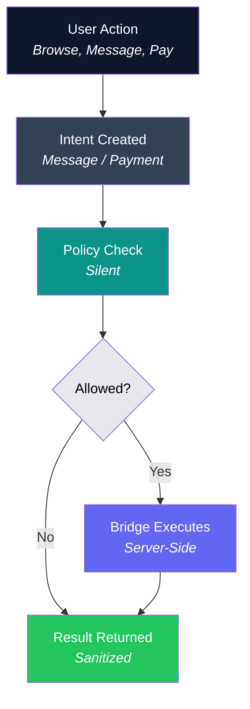

# Privxx Phase-2 — Intent Flow Diagram

**Purpose:** User-friendly explanation of how Privxx handles actions privately.

---

## Visual Flow

---

## How It Works

| Step | What Happens | Privacy Benefit |
|------|--------------|-----------------|
| **1. User Action** | User browses, messages, or initiates payment | Action stays local |
| **2. Intent Created** | App creates an intent, not a network request | No metadata leaks |
| **3. Policy Check** | Silent evaluation of context and signals | User isn't tracked |
| **4. Decision** | Allow, warn, or deny based on policy | Privacy-first defaults |
| **5. Bridge Executes** | Server-side execution through cMixx | IP/timing hidden |
| **6. Result Returned** | Browser receives sanitized response only | No provider exposure |

---

## Key Promise

> **The browser never becomes the network actor.**

Your browser expresses *intent*. The Bridge *executes*. This separation ensures:

- Your IP address is never exposed to destinations
- Payment providers never see your browser fingerprint
- Timing correlation is broken by mixnet routing
- No persistent identifiers are created

---

## Where This Diagram Applies

| Location | Use Case |
|----------|----------|
| `/about` | Explain privacy architecture |
| `/how-it-works` | Onboarding flow |
| Investor deck | Technical differentiator |
| Documentation | Architecture reference |
| Demo script | Visual explanation |

---

## Current Status

| Phase | Intent Flow | Policy Engine | Bridge Execution |
|-------|-------------|---------------|------------------|
| Phase 1 | ❌ | ❌ | ✅ (cMixx messaging) |
| Phase 2 | ✅ Scaffolded | ✅ Stub (always allow) | ✅ Ready |
| Phase 3 | ✅ | ✅ Enforced | ✅ Payments enabled |

---

## Related Documents

- [Phase-2 Architecture](./PRIVXX-PHASE2-ARCHITECTURE.md)
- [Architecture Spec](./PRIVXX-ARCHITECTURE-SPEC.md)
- [Privacy Laws](./PRIVXX-PRIVACY-LAWS.md)

---

**Document Status:** Complete  
**Last Updated:** December 2025
