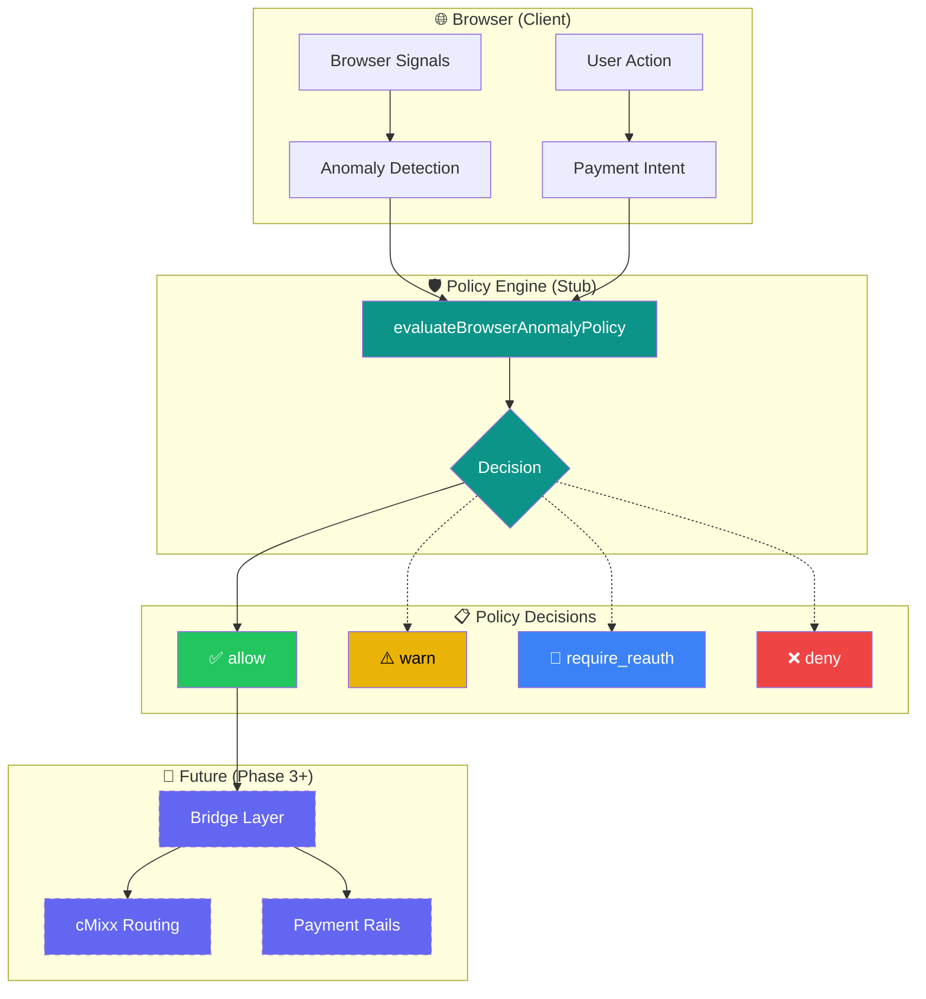

# Privxx Phase-2 Architecture — Policy Engine & Payment Intent

**Status:** ✅ Scaffolding Complete  
**Risk Introduced:** ❌ None  
**Enforcement Active:** ❌ No  

---

## Executive Summary

Phase-2 introduces two foundational layers for future security and payment capabilities:

1. **Browser Anomaly Policy Engine** — A decision layer between browser signals and enforcement
2. **Payment Intent Abstraction** — Decouples user intent from payment execution

Both are **NO-OP stubs** by design. They establish clean architecture without changing app behavior.

---

## Part A — Browser Anomaly Policy Engine

### Purpose

Create a formal decision layer between:
- Browser signals (user agent, platform, hardware)
- Anomaly detection (headless browser, WebDriver, etc.)
- Future enforcement (blocking, re-auth, warnings)

### Current Behavior

| Input | Output | Side Effects |
|-------|--------|--------------|
| Any context | `"allow"` | None |

### Architecture

```
Browser Signals
      ↓
  Anomaly Detection
      ↓
  Policy Engine (stub)
      ↓
  Decision: "allow" | "warn" | "require_reauth" | "deny"
      ↓
  Enforcement (DISABLED)
```

### Files

| File | Purpose |
|------|---------|
| `src/lib/policy/types.ts` | Type definitions for policy decisions |
| `src/lib/policy/browserAnomalyPolicy.ts` | Policy evaluation function (always returns "allow") |
| `src/hooks/useBrowserPolicyDecision.ts` | React hook for accessing policy decisions |
| `src/features/diagnostics/components/BrowserPolicyCard.tsx` | Diagnostics display |

### Future Expansion (Phase 3+)

When enforcement is enabled, the policy engine will support:
- Anomaly thresholds and risk scoring
- Intent-specific rules (browsing vs payments)
- Graduated responses (warn → re-auth → deny)
- Audit logging of decisions

---

## Part B — Payment Intent Abstraction

### Purpose

Ensure the browser **never** directly accesses:
- Payment providers (Stripe, Interac, etc.)
- Card networks
- Bank APIs
- Wallet providers

Instead, the browser expresses **intent**, which routes through policy before execution.

### Current Behavior

| Input | Output | Network Calls |
|-------|--------|---------------|
| Any intent | `{ accepted: true }` | None |

### Architecture

```
User Action
      ↓
  Payment Intent
      ↓
  Policy Engine (stub)
      ↓
  Bridge (future)
      ↓
  Payment Rail (future)
```

### Files

| File | Purpose |
|------|---------|
| `src/lib/payments/types.ts` | Intent type definitions |
| `src/lib/payments/submitIntent.ts` | Intent capture (logs only, no network) |
| `src/lib/payments/submitIntentWithPolicy.ts` | Policy-aware wrapper |

### Intent Types

| Type | Description |
|------|-------------|
| `purchase` | One-time payment to merchant |
| `subscription` | Recurring payment setup |
| `donation` | Voluntary contribution |

### Future Expansion (Phase 3+)

When payment rails are integrated:
- Intent validation and sanitization
- Policy-based approval/denial
- Secure bridge transmission
- Provider abstraction (Stripe, Interac, xx Coin)

---

## Security Guarantees

These guarantees remain unchanged throughout Phase 2:

| Guarantee | Status |
|-----------|--------|
| No browser secrets | ✅ Enforced |
| No payment credentials in browser | ✅ Enforced |
| No direct provider access | ✅ Enforced |
| No enforcement active | ✅ By design |
| Full audit trail possible | ✅ Architecture ready |

---

## What Phase-2 Does NOT Do

| Prohibited Action | Reason |
|-------------------|--------|
| Block users | No enforcement active |
| Score risk | Stub only |
| Store anomaly signals | Privacy-first design |
| Integrate payment providers | Future phase |
| Modify auth flows | Out of scope |

---

## Acceptance Criteria

| Criterion | Status |
|-----------|--------|
| App behavior unchanged | ✅ |
| Diagnostics show signals + decision | ✅ |
| Policy decision always "allow" | ✅ |
| Payment intent logs only | ✅ |
| No network calls added | ✅ |
| No CI changes required | ✅ |

---

## Phase Progression

```
Phase 1 (Complete)
├── Browser → Bridge → xxDK/cMixx
├── Real messaging infrastructure
├── Real identity management
└── No browser secrets

Phase 2 (Current — Scaffolded)
├── Policy Engine stub
├── Payment Intent abstraction
├── Diagnostics integration
└── No enforcement

Phase 3 (Future)
├── Risk scoring
├── Graduated enforcement
├── Payment rail integration
└── Audit logging
```

---

## Stakeholder FAQ

**Q: Does this change how the app works?**  
A: No. All stubs return "allow" and perform no enforcement.

**Q: Is any user data being collected?**  
A: No. Signals are collected locally for diagnostics display only. Nothing is transmitted.

**Q: When will payments be live?**  
A: Payment intent is scaffolding only. Live payments require Phase 3+ bridge integration.

**Q: What's the benefit of doing this now?**  
A: Clean architecture from day one. When enforcement or payments are needed, the foundation exists.

---

## Visual Architecture Diagram



### Diagram Key

| Element | Description |
|---------|-------------|
| **Solid lines** | Active in Phase 2 |
| **Dashed lines** | Future implementation (Phase 3+) |
| **Teal boxes** | Policy Engine components |
| **Purple dashed boxes** | Bridge/execution layer (future) |

### Current Flow (Phase 2)

1. **User Action** → Creates a Payment Intent or triggers browser signal collection
2. **Browser Signals** → Passed through Anomaly Detection
3. **Policy Engine** → Evaluates context, **always returns "allow"**
4. **Decision** → Logged for diagnostics, no enforcement

### Future Flow (Phase 3+)

1. Policy Engine will score risk and make graduated decisions
2. Bridge Layer will receive approved intents
3. cMixx routing for private message/payment transmission
4. Payment Rails for provider abstraction

---

## Related Documents

- [Privacy Laws](./PRIVXX-PRIVACY-LAWS.md)
- [Architecture Spec](./PRIVXX-ARCHITECTURE-SPEC.md)
- [Roadmap](./PRIVXX-ROADMAP.md)
- [Design Constitution](./PRIVXX-DESIGN-CONSTITUTION.md)

---

**Document Status:** Locked for Phase 2  
**Last Updated:** December 2025
