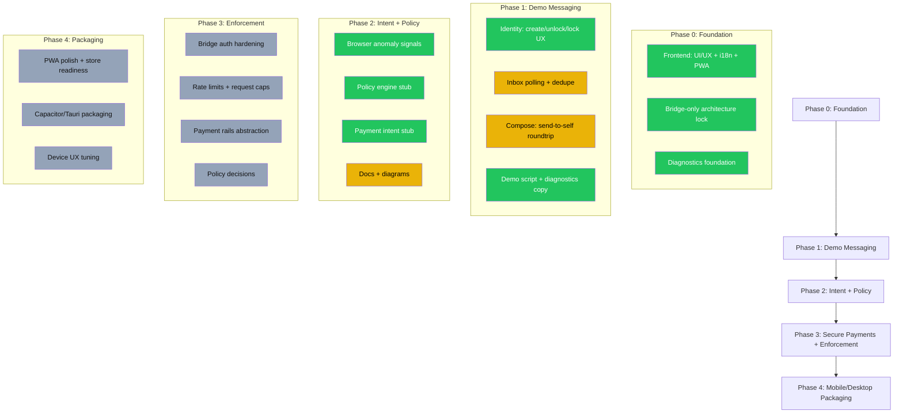

# Privxx Roadmap (Public)

## Status Labels

| Label | Meaning |
|-------|---------|
| 🟢 done | Implemented and merged |
| 🟡 doing | In progress |
| ⚪ todo | Planned |

## Phase Details

### Phase 0: Foundation ✅

- Frontend UI/UX complete with 16-language i18n
- PWA install support
- Bridge-only architecture locked
- Diagnostics foundation in place

### Phase 1: Demo Messaging 🟡

- Identity create/unlock/lock UX complete
- Inbox polling and deduplication in progress
- Compose panel with send-to-self roundtrip
- Demo script and diagnostics copy finalized

### Phase 2: Intent + Policy 🟡

- Browser anomaly signals implemented
- Policy engine stub (allow-all) in place
- Payment intent abstraction stub ready
- Documentation and diagrams in progress

### Phase 3: Secure Payments + Enforcement 📋

- Bridge authentication hardening (JWT/Access)
- Rate limits and request caps
- Payment rails abstraction
- Policy decisions (warn/reauth/deny)

### Phase 4: Mobile/Desktop Packaging 📋

- PWA polish for app store readiness
- Capacitor/Tauri packaging exploration
- Device-specific UX tuning
